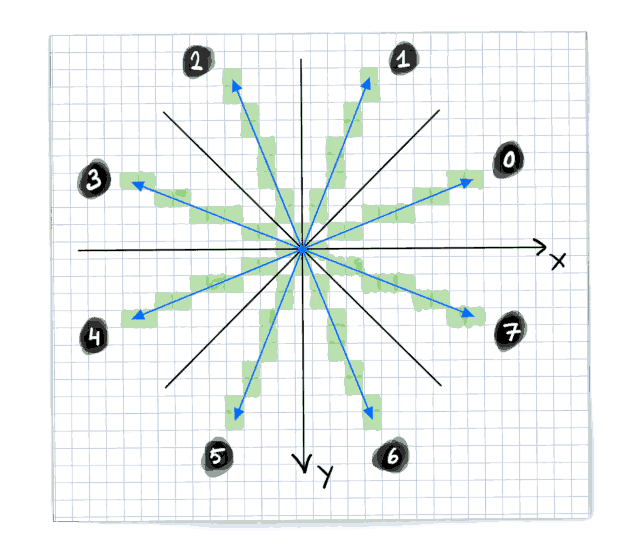
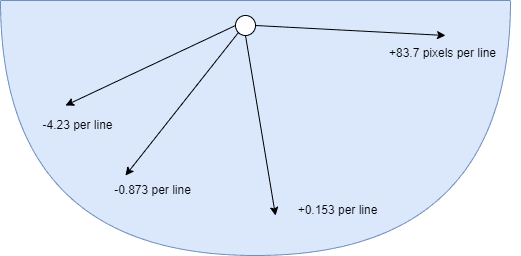

# Chapter 10: VERA FX Reference

*Author: MooingLemur, based on documentation written by JeffreyH*

**This is preliminary documentation and the specification can still change at any point.**

# Introduction

This is a reference for the VERA FX features.  It is meant to be a complement to the tutorial, currently found [here](https://docs.google.com/document/d/1q34uWOiM3Be2pnaHRVgSdHySI-qsiQWPTo_gfE54PTg).

The FX Update mainly adds "helpers" inside of VERA that can be used by the CPU. There is no "magic button" that allows you to do 3D graphics for example. It mainly helps at certain CPU time-consuming tasks, most notably the ones that are present in the (deep) inner-loop of a game/graphics engine. The FX Update does therefore not fundamentally change the architecture or nature of VERA, it extends and improves it.

In other words: the CPU is still the orchestrator of all that is done, but it is alleviated from certain operations where it is not (very) good at or does not have direct access to.

**FX Update extends addressing modes, it does not add or extend renderers.**

# Usage

### DCSEL

VERA is mapped as 32 8-bit registers in the memory space of the Commander X16, starting at address $9F20 and ending at $9F3F. Many of these are (fully) used, but some bits remain unused. The DCSEL bits in register $9F25 (also called CTRL) has been extended to 6-bits to allow for the 4 registers $9F29-$9F2C to have additional meanings.

<table>
	<tr>
		<th>Addr</th>
		<th>Name</th>
		<th>Bit&nbsp;7</th>
		<th>Bit&nbsp;6</th>
		<th>Bit&nbsp;5</th>
		<th>Bit&nbsp;4</th>
		<th>Bit&nbsp;3</th>
		<th>Bit&nbsp;2</th>
		<th>Bit&nbsp;1</th>
		<th>Bit&nbsp;0</th>
	</tr>
	<tr>
		<td>$9F25</td>
		<td>CTRL</td>
		<td colspan="1" align="center">Reset</td>
		<td colspan="6" align="center"><b>DCSEL</b><br></td>
		<td colspan="1" align="center">ADDRSEL</td>
	</tr>
</table>

The FX features use DCSEL values 2, 3, 4, 5, and 6. This effectively gives FX 20 8-bit registers. Note that 15 of these registers are *write-only*, 2 of them are *read-only* and 3 are both *readable* and *writable*,

***Important***: *unless DCSEL values of 2-6 are used, the behavior of VERA is exactly the same as it was before the FX update. This ensures that the FX update is backwards compatible with traditional non-FX uses of VERA.*

### Addr1 Mode

When DCSEL=2, the main FX configuration register becomes available (FX_CTRL/$9F29), which is both readable and writable. The 2 lower bits are the addr1 mode bits, which will change the behavior of how and when ADDR1 is updated. This puts the FX helpers in a certain "role". 

<table>
	<tr>
		<th>Addr</th>
		<th>Name</th>
		<th>Bit&nbsp;7</th>
		<th>Bit&nbsp;6</th>
		<th>Bit&nbsp;5</th>
		<th>Bit&nbsp;4</th>
		<th>Bit&nbsp;3</th>
		<th>Bit&nbsp;2</th>
		<th>Bit&nbsp;1</th>
		<th>Bit&nbsp;0</th>
	</tr>
	<tr>
		<td>$9F29</td>
		<td>FX_CTRL<br>(DCSEL=2)</td>
		<td align="center">Transp. Writes</td>
		<td align="center">Cache Write Enable</td>
		<td align="center">Cache Fill Enable</td>
		<td align="center">One-byte Cache Cycling</td>
		<td align="center">16-bit Hop</td>
		<td align="center">4-bit Mode</td>
		<td colspan="2" align="center"><b>Addr1 Mode</b><br></td>
	</tr>
</table>

|Addr1 Mode|Description|
|-|-|
|0|Traditional VERA behavior|
|1|Line draw helper|
|2|Polygon filler helper|
|3|Affine helper|


By default, Addr1 Mode is set to 0 (=00b), which is the **normal** and already-known behavior of `ADDR1`.

<!-- For PDF formatting -->
<div class="page-break"></div>

# Line draw helper

When Addr1 Mode is set to 1 (=01b) the **line draw helper** is enabled.

### Setting up the line draw helper

* Set `ADDR1` to the address of the starting pixel
* Determine the octant (see below) you are going to draw in, which will inform your `ADDR0` and `ADDR1` increments.
	* Set `ADDR1` increment in the direction you will ***always*** increment each step
		* For 8-bit mode: (+1, -1, -320, or +320)
		* For 4-bit mode: (-0.5, +0.5, -160, or +160)
	* Set `ADDR0` increment in the direction you will ***sometimes*** increment. Even though this is the increment for `ADDR0`, we are using it in line draw mode as an incrementer for `ADDR1`.
		* For 8-bit mode: (+1, -1, -320, or +320).
		* For 4-bit mode: (-0.5, +0.5, -160, or +160)
	* For 4-bit mode, the half increments are set via the Nibble Increment bit and optionally the DECR bit in `ADDRx_H`. For the Nibble Increment bit to have effect, the main Address Increment must be set to 0, and the 4-bit Mode bit must be set in FX_CTRL ($9F29, DCSEL=2).
<table>
	<tr>
		<th>Addr</th>
		<th>Name</th>
		<th>Bit&nbsp;7</th>
		<th>Bit&nbsp;6</th>
		<th>Bit&nbsp;5</th>
		<th>Bit&nbsp;4</th>
		<th>Bit&nbsp;3</th>
		<th>Bit&nbsp;2</th>
		<th>Bit&nbsp;1</th>
		<th>Bit&nbsp;0</th>
	</tr>
	<tr>
		<td>$9F22</td>
		<td>ADDRx_H (x=ADDRSEL)</td>
		<td colspan="4" align="center">Address Increment</td>
		<td align="center"><b>DECR</b><br></td>
		<td align="center"><b>Nibble Increment</b><br></td>
		<td align="center">Nibble Address</td>
		<td align="center">VRAM Address (16)</td>
	</tr>
</table>



|Octant|8-bit `ADDR1` increment|8-bit `ADDR0` increment|4-bit `ADDR1` increment|4-bit `ADDR0` increment|
|-|-|-|-|-|
|0|+1|-320|+0.5|-160|
|1|-320|+1|-160|+0.5|
|2|-320|-1|-160|-0.5|
|3|-1|-320|-0.5|-160|
|4|-1|+320|-0.5|+160|
|5|+320|-1|+160|-0.5|
|6|+320|+1|+160|+0.5|
|7|+1|+320|+0.5|+160|

* Set your slope into the two "X Increment" registers (DCSEL=3, see below). Note that increment registers are 15-bit signed fixed-point numbers, and for this mode, the range should be 0.0 to 1.0 inclusive, so you'll either want to store the value of 1, or you'll want to set only the fractional part.

<table>
	<tr>
		<th>Addr</th>
		<th>Name</th>
		<th>Bit&nbsp;7</th>
		<th>Bit&nbsp;6</th>
		<th>Bit&nbsp;5</th>
		<th>Bit&nbsp;4</th>
		<th>Bit&nbsp;3</th>
		<th>Bit&nbsp;2</th>
		<th>Bit&nbsp;1</th>
		<th>Bit&nbsp;0</th>
	</tr>
	<tr>
		<td>$9F29</td>
		<td>FX_X_INCR_L<br>(DCSEL=3)<br>(Write only)</td>
		<td colspan="8" align="center"><b>X Increment (-2:-9) (signed)</b><br></td>
	</tr>
	<tr>
		<td>$9F2A</td>
		<td>FX_X_INCR_H<br>(DCSEL=3)<br>(Write only)</td>
		<td align="center">X Incr. 32x</td>
		<td colspan="5" align="center">X Increment (5:1) (signed)</td>
		<td align="center"><b>X Incr. (0)</b><br></td>
		<td align="center"><b>X Incr. (-1)</b><br></td>
	</tr>
</table>

*Note: Of the two incrementers, the line draw helper uses only the X incrementer. However depending on the octant you are drawing in, this incrementer will be used to depict either x or y pixel increments. So the "X" should not be taken literally here, it just means the first of the two incrementers.*

* As a side effect of in line draw mode, by setting `FX_X_INCR_H` ($9F2A, DCSEL=3), the fractional part (the lower 9 bits) of *X Position* are automatically set to half a pixel. Furthermore, the lowest bit of the pixel position (which acts as an overflow bit) is set to 0 as well. This effectively sets the starting X-position to 0.5 (the center) of a pixel.


*Note: There is no need to set the higher bits of the X position, since the FX X position (accumulator) is only used to track the fractional (subpixel) part of the line draw.*

<!-- For PDF formatting -->
<div class="page-break"></div>

## Polygon filler helper

When Addr1 Mode is set to 2 (=10b) the polygon filler helper is enabled.

### Setting up the polygon filler helper

Assuming a 320 pixel-wide screen
* Set `ADDR0` to the address of the y-position of the top point of the triangle and x=0 (so on the left of the screen). Set its increment to +320 (for 8-bit mode) or +160 (for 4-bit mode).
	* Note: `ADDR0` is used as "base address" for calculating `ADDR1` for each horizontal line of the triangle. `ADDR0` should therefore start at the top of the triangle and increment exactly one line each time.
	* There is no need to set `ADDR1`. This is done by VERA.
* Calculate your slopes (dx/dy) for both the left and right point. Unlike the line draw helper, these slopes can be negative and can exceed 1.0. They are not dependent on octant, but cover the whole 180 degrees downwards. Below is an illustration of some (not-to-scale) examples of increments:

* Set `ADDR1` increment to +1 (for 8-bit mode) or +0.5 (for 4-bit mode)
	* `ADDR1` increment can also be +4 if you use 32-bit cache writes, explained later)
* Set your left slope into the two "X increment" registers and your right slope into the two "Y increment" registers (DCSEL=3, see below).
	* Important: They should be set to half the increment (or decrement) per horizontal line! This is because the polygon filler increments in two steps per line.
* Note that increment registers are 15-bit signed fixed-point numbers:
* 6 bits for the integer pixel increment 
* 9 bits for the fractional (subpixel) increment
* 1 additional bit that indicates the actual value should be multiplied by 32

<table>
	<tr>
		<th>Addr</th>
		<th>Name</th>
		<th>Bit&nbsp;7</th>
		<th>Bit&nbsp;6</th>
		<th>Bit&nbsp;5</th>
		<th>Bit&nbsp;4</th>
		<th>Bit&nbsp;3</th>
		<th>Bit&nbsp;2</th>
		<th>Bit&nbsp;1</th>
		<th>Bit&nbsp;0</th>
	</tr>
	<tr>
		<td>$9F29</td>
		<td>FX_X_INCR_L<br>(DCSEL=3)<br>(Write only)</td>
		<td colspan="8" align="center">X Increment (-2:-9) (signed)</td>
	</tr>
	<tr>
		<td>$9F2A</td>
		<td>FX_X_INCR_H<br>(DCSEL=3)<br>(Write only)</td>
		<td align="center">X Incr. 32x</td>
		<td colspan="6" align="center">X Increment (5:0) (signed)</td>
		<td align="center">X Incr. (-1)</
	</tr>
	<tr>
		<td>$9F2B</td>
		<td>FX_Y_INCR_L<br>(DCSEL=3)<br>(Write only)</td>
		<td colspan="8" align="center">Y/X2 Increment (-2:-9) (signed)</td>
	</tr>
	<tr>
		<td>$9F2C</td>
		<td>FX_Y_INCR_H<br>(DCSEL=3)<br>(Write only)</td>
		<td align="center">Y/X2 Incr. 32x</td>
		<td colspan="6" align="center">Y/X2 Increment (5:0) (signed)</td>
		<td align="center">Y/X2 Incr. (-1)</
	</tr>
</table>

* Due to the fact that we are in "polygon fill"-mode, by setting the high bits of the "X increment" ($9F2A, DCSEL=3), the "X position" (the lower 9 bits of the position in DCSEL=4 and DCSEL=5) are automatically set to half a pixel. The same goes for the high bits of the Y/X2 increment ($9F2C, DCSEL=3) and Y/X2 position. 
* Set the "X position" and "Y/X2 position” to the x-pixel-position of the top triangle point.

<table>
	<tr>
		<th>Addr</th>
		<th>Name</th>
		<th>Bit&nbsp;7</th>
		<th>Bit&nbsp;6</th>
		<th>Bit&nbsp;5</th>
		<th>Bit&nbsp;4</th>
		<th>Bit&nbsp;3</th>
		<th>Bit&nbsp;2</th>
		<th>Bit&nbsp;1</th>
		<th>Bit&nbsp;0</th>
	</tr>
	<tr>
		<td>$9F29</td>
		<td>FX_X_POS_L<br>(DCSEL=4)<br>(Write only)</td>
		<td colspan="8" align="center"><b>X Position (7:0)</b><br></td>
	</tr>
	<tr>
		<td>$9F2A</td>
		<td>FX_X_POS_H<br>(DCSEL=4)<br>(Write only)</td>
		<td align="center">X Pos. (-9)</td>
		<td colspan="4" align="center">-</td>
		<td colspan="3" align="center"><b>X Position (10:8)</b><br></td>
	</tr>
	<tr>
		<td>$9F2B</td>
		<td>FX_Y_POS_L<br>(DCSEL=4)<br>(Write only)</td>
		<td colspan="8" align="center"><b>Y/X2 Position (7:0)</b><br></td>
	</tr>
	<tr>
		<td>$9F2C</td>
		<td>FX_Y_POS_H<br>(DCSEL=4)<br>(Write only)</td>
		<td align="center">Y/X2 Pos. (-9)</td>
		<td colspan="4" align="center">-</td>
		<td colspan="3" align="center"><b>Y/X2 Position (10:8)</b><br></td>
	</tr>
</table>

Steps that are needed for filling a triangle part with lines:
* Read from `DATA1`
	* This will not return any useful data but will do two things in the background:
		* Increment/decrement the X1 and X2 positions by their corresponding increment values.
		* Set `ADDR1` to `ADDR0` + X1

* Then read the “Fill length (low)”-register.  Its output depends on whether you're in 4 or 8-bit mode.
<table>
	<tr>
		<th>Addr</th>
		<th>Name</th>
		<th>Bit&nbsp;7</th>
		<th>Bit&nbsp;6</th>
		<th>Bit&nbsp;5</th>
		<th>Bit&nbsp;4</th>
		<th>Bit&nbsp;3</th>
		<th>Bit&nbsp;2</th>
		<th>Bit&nbsp;1</th>
		<th>Bit&nbsp;0</th>
	</tr>
	<tr>
		<td>$9F2B</td>
		<td>FX_POLY_FILL_L<br>(DCSEL=5, 4-bit Mode=0)<br>(Read only)</td>
		<td align="center">Fill Len >= 16</td>
		<td colspan="2" align="center">X Position (1:0)</td>
		<td colspan="4" align="center">Fill Len (3:0)</td>
		<td align="center">0</td>
	</tr>
	<tr>
		<td>$9F2B</td>
		<td>FX_POLY_FILL_L<br>(DCSEL=5, 4-bit Mode=1, 2-bit Polygon=0)<br>(Read only)</td>
		<td align="center">Fill Len >= 8</td>
		<td colspan="2" align="center">X Position (1:0)</td>
		<td align="center">X Pos. (2)</td>
		<td colspan="3" align="center">Fill Len (2:0)</td>
		<td align="center">0</td>
	</tr>
</table>
* If fill_len >= 16 (or >= 8 in 4-bit mode) then also read the “Fill length (high)”-register:
<table>
	<tr>
		<th>Addr</th>
		<th>Name</th>
		<th>Bit&nbsp;7</th>
		<th>Bit&nbsp;6</th>
		<th>Bit&nbsp;5</th>
		<th>Bit&nbsp;4</th>
		<th>Bit&nbsp;3</th>
		<th>Bit&nbsp;2</th>
		<th>Bit&nbsp;1</th>
		<th>Bit&nbsp;0</th>
	</tr>
	<tr>
		<td>$9F2C</td>
		<td>FX_POLY_FILL_H<br>(DCSEL=5)<br>(Read only)</td>
		<td colspan="7" align="center">Fill Len (9:3)</td>
		<td align="center">0</td>
	</tr>
</table>
**Important**: when the two highest bits of Fill Len (bits 8 and 9) are both 1, it means there is a negative fill length. The line should not be drawn!

* Together they give you 10-bits of fill length (ignore the other bits for now). Since `ADDR1` is already set properly you can immediately start drawing this number of pixels (given by Fill Len).
	* `sta DATA1` ; as many times as Fill Len states
* Then read from `DATA0`: this will (also) increment X1 and X2
* Check if all lines of this triangle part have been drawn, if not go to the first step.

There is also a 2-bit polygon mode, which is better explained in the [tutorial](https://docs.google.com/document/d/1q34uWOiM3Be2pnaHRVgSdHySI-qsiQWPTo_gfE54PTg)


## Affine helper

When Addr1 Mode is set to 3 (=11b) the affine (transformation) helper is enabled.

When reading from ADDR1 in this mode, the affine helper reads tile data from a special tile area defined by two new FX registers:
* FX_TILEBASE is pointed to a set of 8x8 tiles in either 4-bit or 8-bit depth. FX can support up to 256 tile definitions, and can overlap the traditional layer tile bases.
* FX_MAPBASE points to a square-shaped tile map, one byte per tile. This tile map has no attribute bytes. unlike the traditional layer 0/1 tile maps.

<table>
	<tr>
		<th>Addr</th>
		<th>Name</th>
		<th>Bit&nbsp;7</th>
		<th>Bit&nbsp;6</th>
		<th>Bit&nbsp;5</th>
		<th>Bit&nbsp;4</th>
		<th>Bit&nbsp;3</th>
		<th>Bit&nbsp;2</th>
		<th>Bit&nbsp;1</th>
		<th>Bit&nbsp;0</th>
	</tr>
	<tr>
		<td>$9F2A</td>
		<td>FX_TILEBASE<br>(DCSEL=2)<br>(Write only)</td>
		<td colspan="6" align="center"><b>FX Tile Base Address (16:11)</b><br></td>
		<td align="center"><b>Affine Clip Enable</b><br></td>
		<td align="center">2-bit Polygon</td>
	</tr>
	<tr>
		<td>$9F2B</td>
		<td>FX_MAPBASE<br>(DCSEL=2)<br>(Write only)</td>
		<td colspan="6" align="center"><b>FX Map Base Address (16:11)</b><br></td>
		<td colspan="2" align="center"><b>Map Size</b><br></td>
	</tr>
</table>

* **Affine Clip Enable** changes the behavior when the X/Y positions are outside of the tile map such that it always reads data from tile 0. The default behavior is to wrap the X/Y position to the opposite side of the map.
* **Map Size** is a 2 bit value that affects both the width and height of the tile map.

|Map Size|Dimensions|
|-|-|
|0|2×2|
|1|8×8|
|2|32×32|
|3|128×128|

* The **Transparent Writes** toggle in FX_CTRL is especially useful in Affine helper mode.  Setting this toggle causes a write of zero to leave the byte (or the nibble) at the target address intact.  This toggle is not limited to affine helper mode, and it affects writes to both DATA0 and DATA1.

<table>
	<tr>
		<th>Addr</th>
		<th>Name</th>
		<th>Bit&nbsp;7</th>
		<th>Bit&nbsp;6</th>
		<th>Bit&nbsp;5</th>
		<th>Bit&nbsp;4</th>
		<th>Bit&nbsp;3</th>
		<th>Bit&nbsp;2</th>
		<th>Bit&nbsp;1</th>
		<th>Bit&nbsp;0</th>
	</tr>
	<tr>
		<td>$9F29</td>
		<td>FX_CTRL<br>(DCSEL=2)</td>
		<td align="center"><b>Transp. Writes</b><br></td>
		<td align="center">Cache Write Enable</td>
		<td align="center">Cache Fill Enable</td>
		<td align="center">One-byte Cache Cycling</td>
		<td align="center">16-bit Hop</td>
		<td align="center">4-bit Mode</td>
		<td colspan="2" align="center">Addr1 Mode</td>
	</tr>
</table>

When using the affine helper, the X and Y position registers (DCSEL=4) are used to set ADDR1 to the source pixel indirectly in the aforementioned tile map, while the X and Y increments determine the step after each read of ADDR1.

<table>
	<tr>
		<th>Addr</th>
		<th>Name</th>
		<th>Bit&nbsp;7</th>
		<th>Bit&nbsp;6</th>
		<th>Bit&nbsp;5</th>
		<th>Bit&nbsp;4</th>
		<th>Bit&nbsp;3</th>
		<th>Bit&nbsp;2</th>
		<th>Bit&nbsp;1</th>
		<th>Bit&nbsp;0</th>
	</tr>
	<tr>
		<td>$9F29</td>
		<td>FX_X_POS_L<br>(DCSEL=4)<br>(Write only)</td>
		<td colspan="8" align="center"><b>X Position (7:0)</b><br></td>
	</tr>
	<tr>
		<td>$9F2A</td>
		<td>FX_X_POS_H<br>(DCSEL=4)<br>(Write only)</td>
		<td align="center">X Pos. (-9)</td>
		<td colspan="4" align="center">-</td>
		<td colspan="3" align="center"><b>X Position (10:8)</b><br></td>
	</tr>
	<tr>
		<td>$9F2B</td>
		<td>FX_Y_POS_L<br>(DCSEL=4)<br>(Write only)</td>
		<td colspan="8" align="center"><b>Y/X2 Position (7:0)</b><br></td>
	</tr>
	<tr>
		<td>$9F2C</td>
		<td>FX_Y_POS_H<br>(DCSEL=4)<br>(Write only)</td>
		<td align="center">Y/X2 Pos. (-9)</td>
		<td colspan="4" align="center">-</td>
		<td colspan="3" align="center"><b>Y/X2 Position (10:8)</b><br></td>
	</tr>
</table>

The affine helper supports the full range of X and Y increment values, including negative values.

<table>
	<tr>
		<th>Addr</th>
		<th>Name</th>
		<th>Bit&nbsp;7</th>
		<th>Bit&nbsp;6</th>
		<th>Bit&nbsp;5</th>
		<th>Bit&nbsp;4</th>
		<th>Bit&nbsp;3</th>
		<th>Bit&nbsp;2</th>
		<th>Bit&nbsp;1</th>
		<th>Bit&nbsp;0</th>
	</tr>
	<tr>
		<td>$9F29</td>
		<td>FX_X_INCR_L<br>(DCSEL=3)<br>(Write only)</td>
		<td colspan="8" align="center">X Increment (-2:-9) (signed)</td>
	</tr>
	<tr>
		<td>$9F2A</td>
		<td>FX_X_INCR_H<br>(DCSEL=3)<br>(Write only)</td>
		<td align="center">X Incr. 32x</td>
		<td colspan="6" align="center">X Increment (5:0) (signed)</td>
		<td align="center">X Incr. (-1)</
	</tr>
	<tr>
		<td>$9F2B</td>
		<td>FX_Y_INCR_L<br>(DCSEL=3)<br>(Write only)</td>
		<td colspan="8" align="center">Y/X2 Increment (-2:-9) (signed)</td>
	</tr>
	<tr>
		<td>$9F2C</td>
		<td>FX_Y_INCR_H<br>(DCSEL=3)<br>(Write only)</td>
		<td align="center">Y/X2 Incr. 32x</td>
		<td colspan="6" align="center">Y/X2 Increment (5:0) (signed)</td>
		<td align="center">Y/X2 Incr. (-1)</
	</tr>
</table>

## 32-bit cache

When the CPU reads a byte via DATA0 or DATA1, and "cache fill enable" is set, the value read will be copied into an indexed location inside the 32-bit cache.

<table>
	<tr>
		<th>Addr</th>
		<th>Name</th>
		<th>Bit&nbsp;7</th>
		<th>Bit&nbsp;6</th>
		<th>Bit&nbsp;5</th>
		<th>Bit&nbsp;4</th>
		<th>Bit&nbsp;3</th>
		<th>Bit&nbsp;2</th>
		<th>Bit&nbsp;1</th>
		<th>Bit&nbsp;0</th>
	</tr>
	<tr>
		<td>$9F29</td>
		<td>FX_CTRL<br>(DCSEL=2)</td>
		<td align="center">Transp. Writes</td>
		<td align="center">Cache Write Enable</td>
		<td align="center"><b>Cache Fill Enable</b><br></td>
		<td align="center">One-byte Cache Cycling</td>
		<td align="center">16-bit Hop</td>
		<td align="center">4-bit Mode</td>
		<td colspan="2" align="center">Addr1 Mode</td>
	</tr>
</table>

 In 8-bit mode, a byte is cached, but in 4-bit mode, a nibble is cached instead. Afterwards, by default, the index into the cache is incremented, and loops back around to 0 after the last index.  The index can be set explicitly via the FX_MULT register.  8-bit mode uses bits 3:2 and ranges from 0-3.  4-bit mode uses bits 3:1 and ranges from 0-7.

<table>
	<tr>
		<th>Addr</th>
		<th>Name</th>
		<th>Bit&nbsp;7</th>
		<th>Bit&nbsp;6</th>
		<th>Bit&nbsp;5</th>
		<th>Bit&nbsp;4</th>
		<th>Bit&nbsp;3</th>
		<th>Bit&nbsp;2</th>
		<th>Bit&nbsp;1</th>
		<th>Bit&nbsp;0</th>
	</tr>
 	<tr>
		<td>$9F2C</td>
		<td>FX_MULT<br>(DCSEL=2)<br>(Write only)</td>
		<td align="center">Reset Accum.</td>
		<td align="center">Accumulate</td>
		<td align="center">Subtract Enable</td>
		<td align="center">Multiplier Enable</td>
		<td colspan="2" align="center"><b>Cache Byte Index</b><br></td>
		<td align="center"><b>Cache Nibble Index</b><br></td>
		<td align="center">Two-byte Cache Incr. Mode</td>
	</tr>
</table>

Alternatively, the cache index can cycle between two adjacent bytes: 0, 1, and back to 0; or 2, 3, and back to 2. This option only has effect in 8-bit mode.

<table>
	<tr>
		<th>Addr</th>
		<th>Name</th>
		<th>Bit&nbsp;7</th>
		<th>Bit&nbsp;6</th>
		<th>Bit&nbsp;5</th>
		<th>Bit&nbsp;4</th>
		<th>Bit&nbsp;3</th>
		<th>Bit&nbsp;2</th>
		<th>Bit&nbsp;1</th>
		<th>Bit&nbsp;0</th>
	</tr>
 	<tr>
		<td>$9F2C</td>
		<td>FX_MULT<br>(DCSEL=2)<br>(Write only)</td>
		<td align="center">Reset Accum.</td>
		<td align="center">Accumulate</td>
		<td align="center">Subtract Enable</td>
		<td align="center">Multiplier Enable</td>
		<td colspan="2" align="center">Cache Byte Index</td>
		<td align="center">Cache Nibble Index</td>
		<td align="center"><b>Two-byte Cache Incr. Mode</b><br></td>
	</tr>
</table>

### Setting the cache data directly

Instead of filling the cache by reading from DATA0 or DATA1, the cache data can also be set directly by writing to the FX_CACHE* registers. Setting the cache directly does not affect the cache index.

<table>
	<tr>
		<th>Addr</th>
		<th>Name</th>
		<th>Bit&nbsp;7</th>
		<th>Bit&nbsp;6</th>
		<th>Bit&nbsp;5</th>
		<th>Bit&nbsp;4</th>
		<th>Bit&nbsp;3</th>
		<th>Bit&nbsp;2</th>
		<th>Bit&nbsp;1</th>
		<th>Bit&nbsp;0</th>
	</tr>
	<tr>
		<td>$9F29</td>
		<td>FX_CACHE_L<br>(DCSEL=6)<br>(Write only)</td>
		<td colspan="8" align="center">Cache (7:0) | Multiplicand (7:0) (signed)</td>
	</tr>
	<tr>
		<td>$9F2A</td>
		<td>FX_CACHE_M<br>(DCSEL=6)<br>(Write only)</td>
		<td colspan="8" align="center">Cache (15:8) | Multiplicand (15:8) (signed)</td>
	</tr>
	<tr>
		<td>$9F2B</td>
		<td>FX_CACHE_H<br>(DCSEL=6)<br>(Write only)</td>
		<td colspan="8" align="center">Cache (23:16) | Multiplier (7:0) (signed)</td>
	</tr>
	<tr>
		<td>$9F2C</td>
		<td>FX_CACHE_U<br>(DCSEL=6)<br>(Write only)</td>
		<td colspan="8" align="center">Cache (31:24) | Multiplier (15:8) (signed)</td>
	</tr>
</table>

### Writing the cache to VRAM

If "Cache write enabled" is set, the cache contents are written to VRAM when writing to DATA0 or DATA1.  The primary use is to write all or part of the 32-bit cache to the 4-byte-aligned region of memory at the current address.

Control over which parts are written are chosen by the value written to DATA0 or DATA1. The value written is treated as a **nibble mask** where a 0-bit writes the data and a 1-bit masks the data from being written.In other words, writing a 0 will flush the entire 32-bit cache. Writing `#%00001111` will write the second and third byte in the cache to VRAM in the second and third memory locations in the 4-byte-aligned region.


<table>
	<tr>
		<th>Addr</th>
		<th>Name</th>
		<th>Bit&nbsp;7</th>
		<th>Bit&nbsp;6</th>
		<th>Bit&nbsp;5</th>
		<th>Bit&nbsp;4</th>
		<th>Bit&nbsp;3</th>
		<th>Bit&nbsp;2</th>
		<th>Bit&nbsp;1</th>
		<th>Bit&nbsp;0</th>
	</tr>
	<tr>
		<td>$9F29</td>
		<td>FX_CTRL<br>(DCSEL=2)</td>
		<td align="center">Transp. Writes</td>
		<td align="center"><b>Cache Write Enable</b><br></td>
		<td align="center">Cache Fill Enable</td>
		<td align="center">One-byte Cache Cycling</td>
		<td align="center">16-bit Hop</td>
		<td align="center">4-bit Mode</td>
		<td colspan="2" align="center">Addr1 Mode</td>
	</tr>
</table>


### Transparency writes

Transparent writes, when enabled, also applies to cache writes. If enabled, zero bytes (or zero nibbles in 4-bit mode) in the cache, which are treated as transparency pixels, are not written.

<table>
	<tr>
		<th>Addr</th>
		<th>Name</th>
		<th>Bit&nbsp;7</th>
		<th>Bit&nbsp;6</th>
		<th>Bit&nbsp;5</th>
		<th>Bit&nbsp;4</th>
		<th>Bit&nbsp;3</th>
		<th>Bit&nbsp;2</th>
		<th>Bit&nbsp;1</th>
		<th>Bit&nbsp;0</th>
	</tr>
	<tr>
		<td>$9F29</td>
		<td>FX_CTRL<br>(DCSEL=2)</td>
		<td align="center"><b>Transp. Writes<b><br></td>
		<td align="center">Cache Write Enable</td>
		<td align="center">Cache Fill Enable</td>
		<td align="center">One-byte Cache Cycling</td>
		<td align="center">16-bit Hop</td>
		<td align="center">4-bit Mode</td>
		<td colspan="2" align="center">Addr1 Mode</td>
	</tr>
</table>

When "one-byte cache cycling" is turned on and DATA0 or DATA1 is written to, the byte at the current cache index is written to VRAM. When "Cache write enable" is set as well, the byte is duplicated 4 times when writing to VRAM. 

Usually the incrementing of the cache index is only triggered by reading from DATA0 or DATA1 when cache filling is enabled. However it can also be triggered by reading from DATA0 in polygon mode when cache filling is not enabled and "one-byte cache cycling" is enabled. 

<table>
	<tr>
		<th>Addr</th>
		<th>Name</th>
		<th>Bit&nbsp;7</th>
		<th>Bit&nbsp;6</th>
		<th>Bit&nbsp;5</th>
		<th>Bit&nbsp;4</th>
		<th>Bit&nbsp;3</th>
		<th>Bit&nbsp;2</th>
		<th>Bit&nbsp;1</th>
		<th>Bit&nbsp;0</th>
	</tr>
	<tr>
		<td>$9F29</td>
		<td>FX_CTRL<br>(DCSEL=2)</td>
		<td align="center">Transp. Writes</td>
		<td align="center">Cache Write Enable</td>
		<td align="center">Cache Fill Enable</td>
		<td align="center"><b>One-byte Cache Cycling</b><br></td>
		<td align="center">16-bit Hop</td>
		<td align="center">4-bit Mode</td>
		<td colspan="2" align="center">Addr1 Mode</td>
	</tr>
</table>

## Multiplier and accumulator

The 32-bit cache also doubles as an input to the hardware multiplier when Multiplier Enable is set.

<table>
	<tr>
		<th>Addr</th>
		<th>Name</th>
		<th>Bit&nbsp;7</th>
		<th>Bit&nbsp;6</th>
		<th>Bit&nbsp;5</th>
		<th>Bit&nbsp;4</th>
		<th>Bit&nbsp;3</th>
		<th>Bit&nbsp;2</th>
		<th>Bit&nbsp;1</th>
		<th>Bit&nbsp;0</th>
	</tr>
 	<tr>
		<td>$9F2C</td>
		<td>FX_MULT<br>(DCSEL=2)<br>(Write only)</td>
		<td align="center">Reset Accum.</td>
		<td align="center">Accumulate</td>
		<td align="center">Subtract Enable</td>
		<td align="center"><b>Multiplier Enable</b><br></td>
		<td colspan="2" align="center">Cache Byte Index</td>
		<td align="center">Cache Nibble Index</td>
		<td align="center">Two-byte Cache Incr. Mode</td>
	</tr>
</table>

To do a single multiplication, put the two 16-bit inputs into the two halves of the 32-bit cache.

```x86asm
	lda #(2 << 1)
	sta VERA_CTRL        ; $9F25
	stz VERA_FX_CTRL     ; $9F29 (mainly to reset Addr1 Mode to 0)
	lda #%00010000
	sta VERA_FX_MULT     ; $9F2C
	lda #(6 << 1)
	sta VERA_CTRL        ; $9F25
	lda #<69
	sta VERA_FX_CACHE_L  ; $9F29
	lda #>69
	sta VERA_FX_CACHE_M  ; $9F2A
	lda #<420
	sta VERA_FX_CACHE_H  ; $9F2B
	lda #>420
	sta VERA_FX_CACHE_U  ; $9F2C
```

The accumulator can be used to accumulate the sum of several multiplications.  Before doing this single multiplication, ensure this is reset this to zero, otherwise the output will be added to the value of the accumulator before being written.  There are two methods to do this. The first is to write a 1 into bit 7 of FX_MULT ($9F2C, DCSEL=2).  The other, more conveniently, is to read FX_ACCUM_RESET (the same register location as VERA_FX_CACHE_L).

```x86asm
	lda FX_ACCUM_RESET   ; $9F29 (DCSEL=6)
```

To perform the multiplication, it must be written to VRAM first.  This is done via the cache write mechanism. Usually the cache itself is written to VRAM if "Cache Write Enable" is set.  However, if the "Multiplier Enable" bit is also enabled, the multiplier result is written to VRAM instead.

```x86asm
	; Set the ADDR0 pointer to $00000 and write our multiplication result there
	lda #(2 << 1)
	sta VERA_CTRL        ; $9F25
	lda #%01000000       ; Cache Write Enable
	sta VERA_FX_CTRL     ; $9F29
	stz VERA_ADDRx_L     ; $9F20 (ADDR0)
	stz VERA_ADDRx_M     ; $9F21
	stz VERA_ADDRx_H     ; $9F22 ; no increment
	stz VERA_DATA0       ; $9F23 ; multiply and write out result
	lda #%00010000       ; Increment 1
	sta VERA_ADDRx_H     ; $9F22 ; so we can read out the result
	lda VERA_DATA0
	sta $0400
	lda VERA_DATA0
	sta $0401
	lda VERA_DATA0
	sta $0402
	lda VERA_DATA0
	sta $0403
```

*Note*: the VERA works by pre-fetching the contents from VRAM whenever the address pointer is changed or incremented. This happens even when the address increment is 0. Due to this behavior, it is possible to have stale data latched in one of the two data ports if the underlying VRAM is changed via the other data port. This example avoids this scenario by only using ADDR0/DATA0. This potential gotcha was not introduced by the FX update, but rather has always been how VERA behaves.

#### Accumulation

One can also trigger the multiplication and add it to (or subtract it from) the multiplication accumulator by calling "accumulate" in one of two different ways. We could write a 1 into bit 6 of FX_MULT ($9F2C, DCSEL=2), but more conveniently, we can read FX_ACCUM (the same register location as VERA_FX_CACHE_M)

```x86asm
	lda FX_ACCUM         ; $9F2A (DCSEL=6)
```

Once the accumulation is triggered, the result of the operation is stored back into the accumulator.

The default accumulation operation is (multiply then) add. This can be switched to subtraction by setting the Subtract Enable bit in FX_MULT

<table>
	<tr>
		<th>Addr</th>
		<th>Name</th>
		<th>Bit&nbsp;7</th>
		<th>Bit&nbsp;6</th>
		<th>Bit&nbsp;5</th>
		<th>Bit&nbsp;4</th>
		<th>Bit&nbsp;3</th>
		<th>Bit&nbsp;2</th>
		<th>Bit&nbsp;1</th>
		<th>Bit&nbsp;0</th>
	</tr>
 	<tr>
		<td>$9F2C</td>
		<td>FX_MULT<br>(DCSEL=2)<br>(Write only)</td>
		<td align="center">Reset Accum.</td>
		<td align="center">Accumulate</td>
		<td align="center"><b>Subtract Enable</b><br></td>
		<td align="center">Multiplier Enable</td>
		<td colspan="2" align="center">Cache Byte Index</td>
		<td align="center">Cache Nibble Index</td>
		<td align="center">Two-byte Cache Incr. Mode</td>
	</tr>
</table>

If the multiplication accumulator has a nonzero value, any multiplications carried out via a VRAM Cache write will be offset by the value of the accumulator (either added to or subtracted from the accumulator), but they will not change the value of the accumulator.

### 16-bit hop

There is a special address increment mode that can be used to read pairs of bytes via ADDR1. 

<table>
	<tr>
		<th>Addr</th>
		<th>Name</th>
		<th>Bit&nbsp;7</th>
		<th>Bit&nbsp;6</th>
		<th>Bit&nbsp;5</th>
		<th>Bit&nbsp;4</th>
		<th>Bit&nbsp;3</th>
		<th>Bit&nbsp;2</th>
		<th>Bit&nbsp;1</th>
		<th>Bit&nbsp;0</th>
	</tr>
	<tr>
		<td>$9F29</td>
		<td>FX_CTRL<br>(DCSEL=2)</td>
		<td align="center">Transp. Writes</td>
		<td align="center">Cache Write Enable</td>
		<td align="center">Cache Fill Enable</td>
		<td align="center">One-byte Cache Cycling</td>
		<td align="center"><b>16-bit Hop</b><br></td>
		<td align="center">4-bit Mode</td>
		<td colspan="2" align="center">Addr1 Mode</td>
	</tr>
</table>

In this mode, setting ADDR1's increment to +4 will result in alternating increments of +1 and +3. Setting it to +320 will result in alternating increments of +1 and +319. All other increment values, including negative increments, lack this special hop property.

After this bit is set, writing to ADDRx_L resets the hop alignment such that the first increment is +1.

This mode is useful for reading out a series of 16-bit values after a series of multiplications.

For a more detailed explanation of chained math operations, see the [tutorial](https://docs.google.com/document/d/1q34uWOiM3Be2pnaHRVgSdHySI-qsiQWPTo_gfE54PTg).

<!-- For PDF formatting -->
<div class="page-break"></div>
