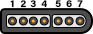
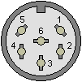
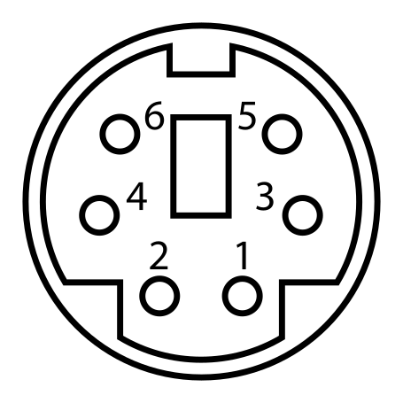
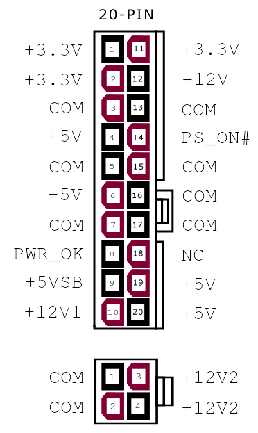

## Chapter 12: Hardware Pinouts

This chapter covers pinout for the I/O ports and performing firmware updates on the SMC, VERA, and system ROMs.

### Port and Socket Listing
* VERA Connectors
  * VERA Mainboard socket
  * SD Card
  * Composite Video
  * S-Video
  * VGA
* SNES Controller Ports (x2)
* IEC Port
* PS/2 Keyboard and mouse
* Expansion Ports (x4)
* User Port header
* ATX Power Supply
* Front Panel

## Disclaimer

The instructions and information in this document are the best available information at the time of writing. This information is subject to change, and no warranty is implied. We are not liable for damage or injury caused by use or misuse of this information, including damage caused by inaccurate information. Interfacing and modifying your Commander X16 is done solely at your own risk.

If you attempt to upgrade your firmware and the process fails, one of our community members may be able to help. Please visit the forums or the Discord community, both of which can be reached through https://commanderx16.com.

### VERA Connectors

TODO

### SNES Ports

The computer contains two SNES style ports and will work with Super Nintendo compatible game pads. 

| Pin # | Description | Wire Color
|-------|-------------|-------------
| 1 | +5v | White
| 2 | Data Clock | Yellow/Red
| 3 | Data Latch | Orange
| 4 | Serial Data | Red/Yellow
| 5 | N/C | -
| 6 | N/C | -
| 7 | Ground | Brown

The Data Clock and Data Latch are generated by the computer and can be shared between the two ports. The Serial Data line is unique per controller.

Thanks to [Console Mods Wiki](https://consolemods.org/wiki/SNES:Connector_Pinouts)

### IEC Port

The IEC port is a female 6 pin DIN 45322 connector. The pinout and specifications are the same as the Commodore 128 computer, with the required lines for Fast IEC, as used by the 1571 and 1581 diskette drives. 1541 drives are also compatible, using standard IEC mode at 4800 bits/sec.

|Pin | Description	| Signal direction	| Remark
|----|--------------|-------------------|--------------
| 1  | SERIAL SRQ   | IN                | Serial Service Request In, at the C128 "Fast Serial Clock"
| 2	 | GND	        | -	                | Ground, signal ground (0V)
| 3	 | SERIAL ATN	| OUT               | Attention, for the selection of a device at beginning/end of a transmission
| 4	 | SERIAL CLK	| IN/OUT	        | Clock (for data transmission)
| 5	 | SERIAL DATA	| IN/OUT	        | Data
| 6	 | SERIAL RESET	| OUT(/IN)	        | Reset 

The IEC protocol is beyond the scope of this document. Please see [Wikipedia](https://en.wikipedia.org/wiki/Commodore_bus) for more information. 

### PS/2 Keyboard and Mouse

| Pin | Name  | Description
|-----|-------|-------------
| 1   | +DATA | Data 
| 2	  | NC    | Not connected
| 3	  | GND	  | Ground
| 4	  | Vcc	  | +5 VDC
| 5	  |+CLK	  | Clock
| 6	  | NC    | Not Connected

### Expansion Ports

The expansion ports can be used for ROM cartridges or I/O modules and contain the full CPU address and data bus, plus the ROM bank select lines, stereo audio, and 5 IO select lines. 

The expansion/cartridge port is a 60 pin edge connector with 2.54mm pitch. Pin 1 is in the rear-left corner.

|   Desc |  Pin |   | Pin  | Desc |
|-------:|-----:|---|------|------|
|   -12V |   1 |\[ \]| 2  | +12V  |
|    GND |   3 |\[ \]| 4  | +5V   |
|AUDIO_L |   5 |\[ \]| 6  | GND   |
|AUDIO_R |   7 |\[ \]| 8  | ROMB7 |
|    IO3 |   9 |\[ \]| 10 | ROMB0 |
|    IO4 |  11 |\[ \]| 12 | ROMB1 |
|    IO7 |  13 |\[ \]| 14 | ROMB6 |
|    IO5 |  15 |\[ \]| 16 | ROMB2 |
|    IO6 |  17 |\[ \]| 18 | ROMB5 |
|   RESB |  19 |\[ \]| 20 | ROMB3 |
|    RDY |  21 |\[ \]| 22 | ROMB4 |
|   IRQB |  23 |\[ \]| 24 | PHI2  |
|     BE |  25 |\[ \]| 26 | RWB   |
|   NMIB |  27 |\[ \]| 28 | MLB   |
|   SYNC |  29 |\[ \]| 30 | D0    |
|     A0 |  31 |\[ \]| 32 | D1    |
|     A1 |  33 |\[ \]| 34 | D2    |
|     A2 |  35 |\[ \]| 36 | D3    |
|     A3 |  37 |\[ \]| 38 | D4    |
|     A4 |  39 |\[ \]| 40 | D5    |
|     A5 |  41 |\[ \]| 42 | D6    |
|     A6 |  43 |\[ \]| 44 | D7    |
|     A7 |  45 |\[ \]| 46 | A15   |
|     A8 |  47 |\[ \]| 48 | A14   |
|     A9 |  49 |\[ \]| 50 | A13   |
|    A10 |  51 |\[ \]| 52 | A12   |
|    A11 |  53 |\[ \]| 54 | SDA   |
|    GND |  55 |\[ \]| 56 | SCL   |
|    +5V |  57 |\[ \]| 58 | GND   |
|   +12V |  59 |\[ \]| 60 | -12V  |

To simplify address decoding, pins IO3-IO7 are active for specific, 32-byte address ranges. 

| Address     | Description 
|-------------|------------------
| $9F60-$9FFF | Expansion port I/O range
| $9F60-$9F7F | IO3
| $9F80-$9F9F | IO4
| $9FA0-$9FBF | IO5
| $9FC0-$9FDF | IO6
| $9FE0-$9FFF | IO7

Expansion boards should allow the user to select their desired I/O bank with jumpers or DIP switches, to prevent conflicts with other devices. 

SCL and SDA pins are shared with the i2c connector on j9 and can be used to access i2c peripherals on cartridges or expansion cards. 

ROMB0-ROMB7 are connected to the ROM bank latch at address $01. Values 0-31 ($00-$1F) address the on-board ROM chips, and 32-255 are itended for expansion ROM or RAM chips. This allows for a total of 3.5MB of address space in the $C000-FFFF address range. 

AUDIO_L and AUDIO_R are routed to the J10, the audio option header. 

The other pins are connected to the system bus and directly to the 65C02 processor. 

### User Port Header

By default, the User Port is not routed to a port on the back of the computer. This allows you the greatest flexibility in connecting devices inside or outside your enclosure.

TODO 

### ATX Power Supply

This is an industry standard 20-pin ATX power connector. You don't need an expensive power supply, but it must supply the -12v rail. Not all do, so check your unit to make sure. If you can't tell from the label, you can check Pin 12 and COM. If the clip side is facing away from you, pin 12 will be the second pin on the left on the clip side. 

By CalvinTheMan - Own work, CC BY-SA 4.0, https://commons.wikimedia.org/w/index.php?curid=50881708

The Commander does not use the 4-pin CPU power, GPU power, 4-pin drive power, or SATA power connectors. 

To save space, when running a bare motherboard, we recommend a "Pico PSU" power supply, which derives all of the necessary power lines from a single 12V source. 

### J2 VERA Programming Interface

| Pin | Desc          |
|-----|---------------|
|  1  | +5V           |
|  2  | FPGA_CDONE    |
|  3  | FPGA_CRESET_B |
|  4  | SPI_MISO      | 
|  5  | SPI_MOSI      |
|  6  | SPI_SCK       |
|  7  | SPI_SSEL_N    |
|  8  | GND           |

### J3 

Connect J8 for LPT Compat

### J6 System Speed

| Pin    | Desc          |
|--------|---------------|
|  1 - 2 | 8 MHz         |
|  3 - 4 | 4 MHz         |
|  5 - 6 | 2 MHz         |

### VERA J7 Remote SD Card Option

| Pin | Desc |
|-----|------|
|  1  | CS   |
|  2  | SCK  |
|  3  | MOSI |
|  4  | MISO | 
|  5  | +5V  |
|  6  | GND  |

### J1 ROM Write Protect

Remove J1 to write protect system ROM. With J1 installed, users can program the system ROM using an appropriate ROM flash program. 

### J2 NMI

Connect a button to this pin to generate an Non Maskable Interrupt (NMI) on the CPU. This will execute a BASIC warm start, which will stop any existing program, clear the screen, and print the READY prompt.

### J3 

TODO 

### J4 Extra 65C22 Pins 

| Desc  | Pin |   | Pin | Desc |
|------:|----:|---|-----|------|
| CA1   |  1  |. .|  2  | CA2  |
| PB0   |  3  |. .|  4  | PB1  |
| PB2   |  5  |. .|  6  | CB2  |

## J5 Program Microcontroller 

Remove jumpers from J5 to program microcontroller. 

### J7 SNES 3/4

| Desc  | Pin |   | Pin | Desc |
|------:|----:|---|-----|------|
| CLC   |  1  |. .|  2  | VCC  |
| LATCH |  3  |. .|  4  | DAT4 |
| DAT3  |  5  |. .|  6  | GND  |

These pins will allow for two more SNES controllers, for a total of four controllers on the system. 

### J8 Front Panel

|   Desc    | Pin |   | Pin | Desc      |
|----------:|----:|---|-----|-----------|
| HDD LED+  |  1  |. .|  2  | POW LED + |
| HDD LED-  |  3  |. .|  4  | POW LED - |
| RESET BUT |  5  |. .|  6  | POW BUT   |
| RESET BUT |  7  |. .|  7  | POW BUT   |
| +5VDC     |  9  |. .|  10 | NC        |

### J9 I2C/SMC Header

| Desc             | Pin |   | Pin | Desc        |
|-----------------:|----:|---|-----|-------------|
| SMC MOSI/I2C SDA  |  1  |. .|  2  | 5V STANDBY |
| RTC MFP           |  3  |. .|  4  | SMC TX     |
| SMC Reset         |  5  |. .|  6  | SMC RX     | 
| SMC SCK/I2C SCL   |  7  |. .|  8  | GND        |
| SMC MISO          |  9  |. .|  10 | GND        |

### J10 Audio Option

| Desc   | Pin |   | Pin | Desc  |
|-------:|----:|---|-----|-------|
| SDA    |  1  |. .|  2  | RESB  |
| SCL    |  3  |. .|  4  | VCC   |
|        |  5  |. .|  6  |       | 
| +12V   |  7  |. .|  8  | -12V  |
|        |  9  |. .| 10  |       |
| VERA_L | 11  |. .| 12  | BUS_L | 
|        | 13  |. .| 14  |       |
| VERA_R | 15  |. .| 16  | BUS_R |
|        | 17  |. .| 18  |       | 
| YM_L   | 19  |. .| 20  | OUT_L |
|        | 21  |. .| 22  |       |
| YM_R   | 23  |. .| 24  | OUT_R | 

5,6,9,10,13,14,17,18,21,22 - GND

Next to the audio header is a set of jumer pads, JP1-JP6. Cutting these traces allows you to extract isolated audio from each of the system devices: VERA's PSG oscillators, the FM syntheizers (L and R) and audio devices connected to the expansion ports. 

### J12 User Port

(TODO)

