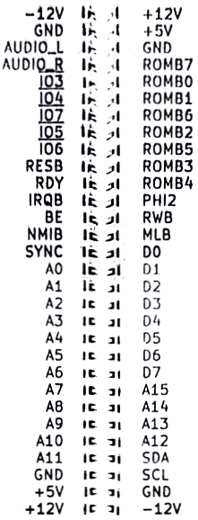

## Chapter 12: Hardware

This chapter covers pinout for the I/O ports and performing firmware updates on the SMC, VERA, and system ROMs.

### Port and Socket Listing
* VERA Connectors
  * VERA Mainboard socket
  * SD Card
  * Composite Video
  * S-Video
  * VGA
* SNES Controller Ports (x2)
* IEC Port
* PS/2 Keyboard and mouse
* Expansion Ports (x4)
* User Port header
* ATX Power Supply
* Front Panel

## Flash Procedures
* System ROM (KERNAL, BASIC, DOS, etc)
	* With EPROM Programmer
	* In system using programming software
* SMC (Keyboard, Mouse, power controller)
    * Using SparkFun AVR programmer
* VERA 
	* USing EPROM Programmer

## Disclaimer

The instructions and information in this document are the best available information at the time of writing. This information is subject to change, and no warranty is implied. We are not liable for damage or injury caused by use or misuse of this information, including damage caused by inaccurate information. Interfacing and modifying your Commander X16 is done solely at your own risk.

If you attempt to upgrade your firmware and the process fails, one of our community members may be able to help. Please visit the forums or the Discord community, both of which can be reached through https://commanderx16.com.

### VERA Connectors

TODO

### SNES Ports

The computer contains two SNES style ports and will work with Super Nintendo compatible game pads. 

| Pin # | Description | Wire Color
|-------|-------------|-------------
| 1 | +5v | White
| 2 | Data Clock | Yellow/Red
| 3 | Data Latch | Orange
| 4 | Serial Data | Red/Yellow
| 5 | N/C | -
| 6 | N/C | -
| 7 | Ground | Brown

The Data Clock and Data Latch are generated by the computer and can be shared between the two ports. The Serial Data line is unique per controller.

Thanks to [Console Mods Wiki](https://consolemods.org/wiki/SNES:Connector_Pinouts)

### IEC Port

The IEC port is a female 6 pin DIN 45322 connector. The pinout and specifications are the same as the Commodore 128 computer, with the required lines for Fast IEC, as used by the 1571 and 1581 diskette drives. 1541 drives are also compatible, using standard IEC mode at 4800 bits/sec.

|Pin | Description	| Signal direction	| Remark
|----|--------------|-------------------|--------------
| 1  | SERIAL SRQ   | IN                | Serial Service Request In, at the C128 "Fast Serial Clock"
| 2	 | GND	        | -	                | Ground, signal ground (0V)
| 3	 | SERIAL ATN	| OUT               | Attention, for the selection of a device at beginning/end of a transmission
| 4	 | SERIAL CLK	| IN/OUT	        | Clock (for data transmission)
| 5	 | SERIAL DATA	| IN/OUT	        | Data
| 6	 | SERIAL RESET	| OUT(/IN)	        | Reset 

The IEC protocol is beyond the scope of this document. Please see [Wikipedia](https://en.wikipedia.org/wiki/Commodore_bus) for more information. 

### PS/2 Keyboard and Mouse

| Pin | Name  | Description
|-----|-------|-------------
| 1   | +DATA | Data 
| 2	  | NC    | Not connected
| 3	  | GND	  | Ground
| 4	  | Vcc	  | +5 VDC
| 5	  |+CLK	  | Clock
| 6	  | NC    | Not Connected

### Expansion Ports

The expansion ports can be used for ROM cartridges or I/O modules and contain the full CPU address and data bus, plus the ROM bank select lines, stereo audio, and 5 IO select lines. 

The IO pins should be active when the CPU addresses specific ports in the External Address I/O range. That range extends from $9F60-$9FFF

| Address     | Description 
|-------------|------------------
| $9F60-$9FFF | External devices             |
| $9F60-$9F7F | IO3
| $9F80-$9F9F | IO4
| $9FA0-$9FBF | IO5
| $9FC0-$9FDF | IO6
| $9FE0-$9FFF | IO7

When using the IO pins, you only need to decode the lowest 5 address lines, 0-4.

**Implementation Note**: I/O ports are shared across all 4 slots, and users will likely use more than one card at the same time. To avoid conflicts, I/O cards are required to allow the user to select the block(s) the card uses. We suggest using DIP switches or jumpers to route the corresponding IO line to your chips' CS pins. 

### User Port Header

By default, the User Port is not routed to a port on the back of the computer. This allows you the greatest flexibility in connecting devices inside or outside the computer. 

TODO 

### ATX Power Supply

This is an industry standard 20-pin ATX power connector. You don't need an expensive power supply, but it must supply the -12v rail. Not all do, so check your unit to make sure. If you can't tell from the label, you can check Pin 12 and COM. If the clip side is facing away from you, pin 12 will be the second pin on the left on the clip side. 

By CalvinTheMan - Own work, CC BY-SA 4.0, https://commons.wikimedia.org/w/index.php?curid=50881708

The Commander does not use the 4-pin CPU power, GPU power, 4-pin drive power, or SATA power connectors. 

To save space, when running a bare motherboard, we recommend a "Pico PSU" power supply, which derives all of the necessary power lines from a single 12V source. 

### Front Panel

TODO 

| Pin | Description 
|-----|--------------
|     | Power LED +
|     | Power LED -
|     | Drive LED +
|     | Drive LED -
|     | Power Button
|     | Power Button
|     | Reset Button
|     | Reset Button

