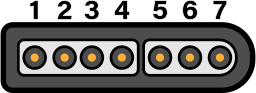
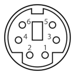
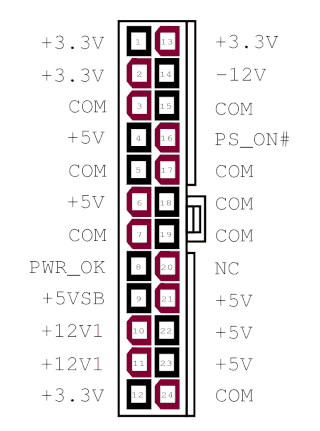
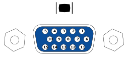
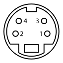

# Chapter 14: Hardware Pinouts

This chapter covers pinout for the I/O ports and headers.

### Port and Socket Listing
* VERA Connectors
* SNES Controller Ports (x2)
* IEC Port
* PS/2 Keyboard and mouse
* Expansion Slots (x4 in Gen1)
* User Port Header
* ATX Power Supply
* Front Panel

Chip sockets are not listed; pinouts are available on their respective data sheets. 

## Disclaimer

The instructions and information in this document are the best available information at the time of writing. This information is subject to change, and no warranty is implied. We are not liable for damage or injury caused by use or misuse of this information, including damage caused by inaccurate information. Interfacing and modifying your Commander X16 is done solely at your own risk.

If you attempt to upgrade your firmware and the process fails, one of our community members may be able to help. Please visit the forums or the Discord community, both of which can be reached through https://commanderx16.com.

### SNES Ports

The computer contains two SNES style ports and will work with Super Nintendo compatible game pads. An on-board pin header is accessible to connect two additional SNES ports.

| Pin # | Description | Wire Color
|-------|-------------|-------------
| 1     | +5v         | White
| 2     | Data Clock  | Yellow/Red
| 3     | Data Latch  | Orange
| 4     | Serial Data | Red/Yellow
| 5     | N/C         | -
| 6     | N/C         | -
| 7     | Ground      | Brown

The Data Clock and Data Latch are generated by the computer and are shared across all SNES ports. The Serial Data line is unique per controller.

Thanks to [Console Mods Wiki](https://consolemods.org/wiki/SNES:Connector_Pinouts)

### IEC Port

The IEC port is a female 6 pin DIN 45322 connector. The pinout and specifications are the same as the Commodore 128 computer, with the required lines for Fast IEC, as used by the 1571 and 1581 diskette drives. 1541 drives are also compatible, using standard IEC mode at 400-600 bytes/sec.

|Pin | Description	| Signal Direction	| Remark
|----|--------------|-------------------|--------------
| 1  | SERIAL SRQ   | IN                | Serial Service Request In, at the C128 "Fast Serial Clock"
| 2	 | GND	        | -	                | Ground, signal ground (0V)
| 3	 | SERIAL ATN	| OUT               | Attention, for the selection of a device at beginning/end of a transmission
| 4	 | SERIAL CLK	| IN/OUT	        | Clock (for data transmission)
| 5	 | SERIAL DATA	| IN/OUT	        | Data
| 6	 | SERIAL RESET	| OUT(/IN)	        | Reset 

The IEC protocol is beyond the scope of this document. Please see [Wikipedia](https://en.wikipedia.org/wiki/Commodore_bus) for more information.

### PS/2 Keyboard and Mouse

| Pin | Name  | Description
|-----|-------|-------------
| 1   | +DATA | Data 
| 2	  | NC    | Not connected
| 3	  | GND	  | Ground
| 4	  | Vcc	  | +5 VDC
| 5	  |+CLK	  | Clock
| 6	  | NC    | Not Connected

### Expansion Cards / Cartridges

The expansion slots can be used for I/O modules and RAM/ROM cartridges and expose the 
full CPU address and data bus, plus the ROM bank select lines, stereo audio, and 5 IO select lines.

The expansion/cartridge port is a 60-pin edge connector with 2.54mm pitch. 
Pin 1 is in the rear-left corner.

|   Desc |  Pin |   | Pin  | Desc |
|-------:|-----:|---|------|------|
|   -12V |   1 |\[ \]| 2  | +12V  |
|    GND |   3 |\[ "VERA FX Reference.md" \\]| 4  | +5V   |
|AUDIO_L |   5 |\[ \]| 6  | GND   |
|AUDIO_R |   7 |\[ \]| 8  | ROMB7 |
|    IO3 |   9 |\[ \]| 10 | ROMB0 |
|    IO4 |  11 |\[ \]| 12 | ROMB1 |
|    IO7 |  13 |\[ \]| 14 | ROMB6 |
|    IO5 |  15 |\[ \]| 16 | ROMB2 |
|    IO6 |  17 |\[ \]| 18 | ROMB5 |
|   RESB |  19 |\[ \]| 20 | ROMB3 |
|    RDY |  21 |\[ \]| 22 | ROMB4 |
|   IRQB |  23 |\[ \]| 24 | PHI2  |
|     BE |  25 |\[ \]| 26 | RWB   |
|   NMIB |  27 |\[ \]| 28 | MLB   |
|   SYNC |  29 |\[ \]| 30 | D0    |
|     A0 |  31 |\[ \]| 32 | D1    |
|     A1 |  33 |\[ \]| 34 | D2    |
|     A2 |  35 |\[ \]| 36 | D3    |
|     A3 |  37 |\[ \]| 38 | D4    |
|     A4 |  39 |\[ \]| 40 | D5    |
|     A5 |  41 |\[ \]| 42 | D6    |
|     A6 |  43 |\[ \]| 44 | D7    |
|     A7 |  45 |\[ \]| 46 | A15   |
|     A8 |  47 |\[ \]| 48 | A14   |
|     A9 |  49 |\[ \]| 50 | A13   |
|    A10 |  51 |\[ \]| 52 | A12   |
|    A11 |  53 |\[ \]| 54 | SDA   |
|    GND |  55 |\[ \]| 56 | SCL   |
|    +5V |  57 |\[ \]| 58 | GND   |
|   +12V |  59 |\[ \]| 60 | -12V  |

To simplify address decoding, pins IO3-IO7 are active for specific, 32-byte memory mapped IO 
(MMIO) address ranges.

| Address     | Usage                               |Speed|
|-------------|-------------------------------------|-----|
|$9F60-$9F7F|Expansion Card Memory Mapped IO3       |8 MHz|
|$9F80-$9F9F|Expansion Card Memory Mapped IO4       |8 MHz|
|$9FA0-$9FBF|Expansion Card Memory Mapped IO5       |2 MHz|
|$9FC0-$9FDF|Expansion Card Memory Mapped IO6       |2 MHz|
|$9FE0-$9FFF|Cartidge/Expansion Memory Mapped IO7   |2 MHz|

Expansion cards can use the IO3-IO6 lines as enable lines to provide their IO address range
(s), or decode the address from the address bus directly. To prevent conflicts with other 
devices, expansion boards should allow the user to select their desired I/O bank with jumpers 
or DIP switches. IO7 is given priority to external cartridges that use MMIO and should be 
only used by an expansion card if there are no other MMIO ranges available. Doing so may
cause a bus conflict with cartridges that make us of MMIO (such as those with expansion
hardware). See below for more information on cartridges.

ROMB0-ROMB7 are connected to the ROM bank latch at address `$01`. Values 0-31 (`$00`-`$1F`) 
address the on-boar"VERA FX Reference.md" \d ROM chips, and 32-255 are intended for expansion ROM or RAM chips 
(typically used by cartridges, see below). This allows for a total of 3.5MB of address space 
in the `$C000-$FFFF` address range.

SCL and SDA pins are shared with the i2c connector on J9 and can be used to access i2c 
peripherals on cartridges or expansion cards.

AUDIO_L and AUDIO_R are routed to J10, the audio option header.

The other pins are connected to the system bus and directly to the 65C02 processor.

#### Cartridges

Cartridges are essentially an expansion card housed in an external enclosure. Typically they are 
used for applications (e.g. games) with the X16 being able to boot directly from a cartridge at
power on. They contain banked ROM and/or RAM and an optional I2C EEPROM 
(for storing game save states).

They can also function as an expansion card which means they can also use MMIO. Similarly an internal
expansion card could contain RAM/ROM as well.

Because of this, while develoeprs are free to use the hardware as they please, to avoid
conflcits, the banked ROM/RAM space is suggested to be used only by cartridges and
cartridges should avoid using MMIO IO3-IO6. Instead, IO7 should be the default option
for cartridges and the last option for expansion cards (only used if there are no 
other IO ranges available).

This helps avoid bus conflicts and an otherwise bad user experience given a 
cartridge should be simple to use from the standpoint of the user
("insert game -> play game").

These are soft guidelines. There is nothing physically preventing an expansion card from using
banked ROM/RAM or a cartridge using any of the MMIO addresses. Doing so risks conflicts and 
compatibility issues.

Cartridges with additional hardware would be similar to expansion chips found on some NES and 
SNES cartridges (think VRC6, Super FX, etc.) and could be used for really anything, 
such as having a MIDI input for a cartridge that is meant as a music maker; 
some sort of hardware accelerator FPGA; network support, etc. 

For more information about the memory map visit the 
[Chapter 7](X16%20Reference%20-%2007%20-%20Memory%20Map.md#chapter-7-memory-map) section of the manual.

##### Booting from Cartridges

After the X16 finishes it's hardware initialization, the kernel checks bank 32 for the signature "CX16"
at `$C000`. If found, it then jumps to `$C004` and leaves interrupts disabled.

### ATX Power Supply

The Commander X16 has a socket for an industry standard 24-pin ATX power supply connector. Either a 24-pin or 20-pin PSU connector can be plugged in, though only the pins for the older 20-pin standard are used by the computer. You don't need an expensive power supply, but it must supply the -12v rail. Not all do, so check your unit to make sure. If you can't tell from the label, you can check Pin 12 and COM. If the clip side is facing away from you, pin 14 will be the second pin on the left on the clip side. For a 20-pin cable, -12v is on pin 12, but at the same relative position &mdash; the second pin on the left on the clip side.

|24-pin ATX power connector, cable end|
|-|
||

By CalvinTheMan - Own work, CC BY-SA 4.0, <https://commons.wikimedia.org/w/index.php?curid=50881708>

The Commander X16 does not use the 4-pin CPU power, GPU power, 4-pin drive power, or SATA power connectors.

To save space, when running a bare motherboard, we recommend a "Pico PSU" power supply, which derives all of the necessary power lines from a single 12V source.

### J1 ROM Write Protect

Remove J1 to write protect system ROM. With J1 installed, users can program the system ROM using an appropriate ROM flash program.

### J2 NMI

Connect a button here to generate an Non Maskable Interrupt (NMI) on the CPU. This will execute a BASIC warm start, which will stop any existing program, clear the screen, and print the READY prompt.

### J3 (Unknown)

Connect J8 for LPT Compat. (TODO: Is this the Centronics parallel port mode Lorin hinted at early on?)

### J4 Extra 65C22 Pins 

| Desc  | Pin |   | Pin | Desc |
|------:|----:|---|-----|------|
| CA1   |  1  |. .|  2  | CA2  |
| PB0   |  3  |. .|  4  | PB1  |
| PB2   |  5  |. .|  6  | CB2  |

These pins are connected to VIA 1 at $9F00-$9F0F.

## J5 Program Microcontroller

Remove jumpers from J5 to program microcontroller.

### J6 System Speed

| Pin    | Desc          |
|--------|---------------|
|  1 - 2 | 8 MHz         |
|  3 - 4 | 4 MHz         |
|  5 - 6 | 2 MHz         |

### J7 SNES 3/4

| Desc  | Pin |   | Pin | Desc |
|------:|----:|---|-----|------|
| CLC   |  1  |. .|  2  | VCC  |
| LATCH |  3  |. .|  4  | DAT4 |
| DAT3  |  5  |. .|  6  | GND  |

These pins will allow for two additional SNES controllers, for a total of four controllers on the system.

### J8 Front Panel

|   Desc    | Pin |   | Pin | Desc      |
|----------:|----:|---|-----|-----------|
| HDD LED+  |  1  |. .|  2  | POW LED + |
| HDD LED-  |  3  |. .|  4  | POW LED - |
| RESET BUT |  5  |. .|  6  | POW BUT   |
| RESET BUT |  7  |. .|  7  | POW BUT   |
| +5VDC     |  9  |. .|  10 | NC        |

This pinout is compatible with newer ATX style motherboards. AT motherboards and older ATX cases may still have a 3-pin power LED connector (with a blank pin in the middle.) You will need to move the + (red) wire on the power LED connector to the center pin, if this is the case. Or you can use two Male-Female breadboard cables to jumper the header to your power LED connector.

There is no on-board speaker header. Instead, all audio is routed to the rear panel headphone jack via the Audio Option header.

### J9 I2C/SMC Header

| Desc             | Pin |   | Pin | Desc        |
|-----------------:|----:|---|-----|-------------|
| SMC MOSI/I2C SDA  |  1  |. .|  2  | 5V STANDBY |
| RTC MFP           |  3  |. .|  4  | SMC TX     |
| SMC Reset         |  5  |. .|  6  | SMC RX     | 
| SMC SCK/I2C SCL   |  7  |. .|  8  | GND        |
| SMC MISO          |  9  |. .|  10 | GND        |

### J10 Audio Option

| Desc   | Pin |   | Pin | Desc  |
|-------:|----:|---|-----|-------|
| SDA    |  1  |. .|  2  | RESB  |
| SCL    |  3  |. .|  4  | VCC   |
|        |  5  |. .|  6  |       | 
| +12V   |  7  |. .|  8  | -12V  |
|        |  9  |. .| 10  |       |
| VERA_L | 11  |. .| 12  | BUS_L | 
|        | 13  |. .| 14  |       |
| VERA_R | 15  |. .| 16  | BUS_R |
|        | 17  |. .| 18  |       | 
| YM_L   | 19  |. .| 20  | OUT_L |
|        | 21  |. .| 22  |       |
| YM_R   | 23  |. .| 24  | OUT_R | 

5,6,9,10,13,14,17,18,21,22 - GND

Next to the audio header is a set of jumper pads, JP1-JP6. Cutting these traces allows you to extract isolated audio from each of the system devices or build a mixer to adjust the relative balance of the audio devices. 

In order to avoid ground loop and power supply noise, we recommend installing a ground loop isolator when using an external mixer. 2 or 3 isolators will be required (one for each stereo pair.)  (TODO: measure noise and test with pro audio gear.)

### J12 User Port

| Desc    | Pin |   | Pin | Desc    |
|--------:|----:|---|-----|---------|
| PB0     |  1  |. .|  2  | PB4     |
| PA0     |  3  |. .|  4  | PB5     |
| PA1     |  5  |. .|  6  | PB6/CB1 | 
| PA2     |  7  |. .|  8  | PB7/CB2 |
| PA3     |  9  |. .| 10  | GND     |
| PA4     | 11  |. .| 12  | GND     |
| PA5     | 13  |. .| 14  | GND     |
| PA6     | 15  |. .| 16  | GND     |
| PA7     | 17  |. .| 18  | GND     | 
| CA1     | 19  |. .| 20  | GND     |
| PB1     | 21  |. .| 22  | GND     |
| PB2     | 23  |. .| 24  | GND     | 
| PB3/CA2 | 25  |. .| 16  | VCC     |

User port is connected to VIA 2 at address $9F10-$9F1F. This can be used for serial or parallel port I/O. Commander X16 does not have support for a serial port device in the KERNAL. 

## VERA Video Header

| Desc    | Pin |   | Pin | Desc    |
|--------:|----:|---|-----|---------|
| VCC     |  1  |. .|  2  | GND     |
| D7      |  3  |. .|  4  | D6      |
| D5      |  5  |. .|  6  | D4      | 
| D3      |  7  |. .|  8  | D2      |
| D1      |  9  |. .| 10  | D0      |
| /IO1    | 11  |. .| 12  | RESB    |
| /MEMWE  | 13  |. .| 14  | IRQB    |
| A4      | 15  |. .| 16  | /MEMOE  |
| A2      | 17  |. .| 18  | A3      | 
| A0      | 19  |. .| 20  | A1      |
| GND     | 21  |. .| 22  | GND     |
| VERA_L  | 23  |. .| 24  | VERA_R  | 

VERA is connected to I/O ports at $9F20-$9F3F. See [Chapter 9](X16%20Reference%20-%2009%20-%20VERA%20Programmer's%20Reference.md#chapter-9-vera-programmers-reference)
for details.

### VGA Connector

| Pin | Desc      |
|-----|-----------|
| 1   | RED |
| 2   | GREEN |
| 3   | BLUE |
| 4   | |
| 5   | GND |
| 6   | RED_RTN |
| 7   | GREEN_RTN |
| 8   | BLUE_RTN |
| 9   | |
| 10  | GND |
| 11  | |
| 12  | |
| 13  | HSync |
| 14  | VSync |
| 15  | |

The VGA connector is a female [DE-15](https://en.wikipedia.org/wiki/D-subminiature#Description,_nomenclature,_and_variants) jack. 

The video resolution is 640x480 59.5FPS progressive scan, RGB color, and separated H/V sync.

In interlace mode, both horizontal and vertical sync pulses will appear on the HSync pin. (TODO: Test with OSSC).

VERA does not use the ID/DDC lines.

### Composite Connector

The Composite video is a standard RCA connector. Center pin carries signal. Shield is signal ground.

The signal is NTSC Composite baseband video.

The video is 480 lines 59.97Hz interlaced. Composite is not available when VGA is running at 59.5Hz progressive scan.

### S-Video Connector

| Pin | Desc      |                       |
|-----|-----------|-----------------------|
| 1   | GND (Y)   |                       |
| 2   | GND (C)   |                       |
| 3   | Y         | Intensity (Luminance) |
| 4   | C         | Color (Chrominance)   |

The connector is a 4-pin Mini-DIN connector. While the same size as a PS/2 connector, the PS/2 connector has a plastic key at the bottom. Do not attempt to plug a keyboard or mouse into the S-Video port, or bent pins will occur.

The signal is NTSC baseband Y/C separated video. S-Video provides better resolution than composite, since the color and intensity are provided on separate pins. you can use a splitter cable to separate the Y and C signals to drive a Commodore 1702 or compatible monitor. 

The video is 480 lines 59.97Hz interlaced. Composite is not available when VGA is running at 59.5Hz progressive scan.

### J2 VERA Programming Interface

| Pin | Desc          |
|-----|---------------|
|  1  | +5V           |
|  2  | FPGA_CDONE    |
|  3  | FPGA_CRESET_B |
|  4  | SPI_MISO      | 
|  5  | SPI_MOSI      |
|  6  | SPI_SCK       |
|  7  | SPI_SSEL_N    |
|  8  | GND           |

### VERA J7 Remote SD Card Option

| Pin | Desc |
|-----|------|
|  1  | CS   |
|  2  | SCK  |
|  3  | MOSI |
|  4  | MISO | 
|  5  | +5V  |
|  6  | GND  |

This requires an EEPROM programmer and an interface board to program. See [Chapter 15](X16%20Reference%20-%2015%20-%20Upgrade%20Guide.md#chapter-15-upgrade-guide) for the programming adapter and instructions.

<!-- For PDF formatting -->

