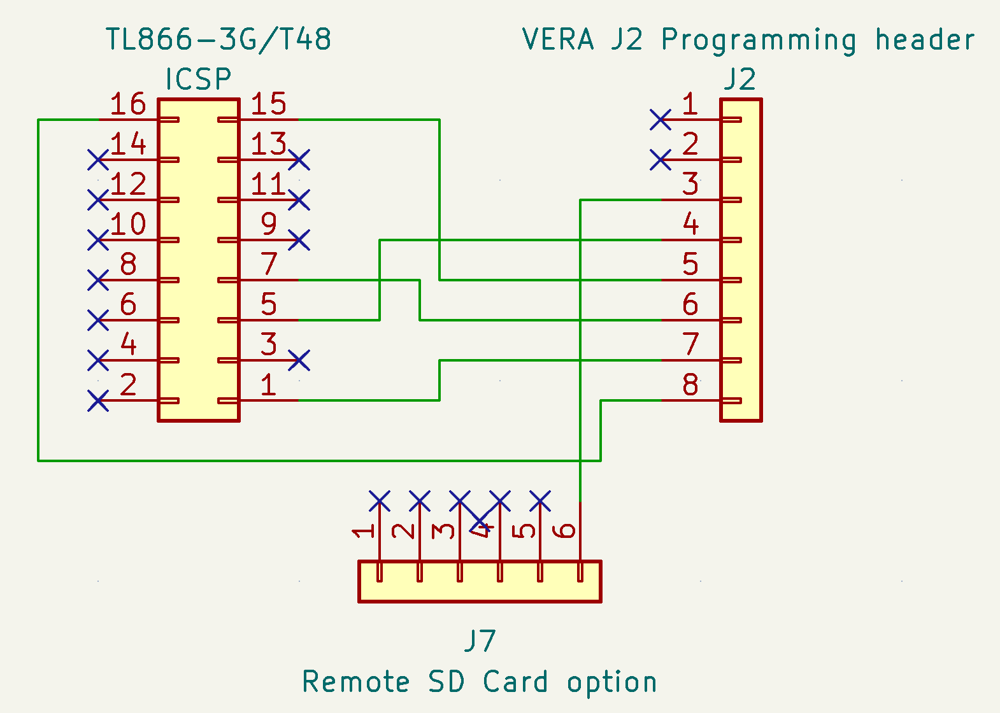

# Appendix B: VERA Firmware Recovery

**WARNING: This is a draft that may contain errors or omissions that could damage your hardware.**

## Using a Windows PC to upgrade or recover a VERA

**Target Component:** VERA  
**Programmer:** TL866-3G/T48  
**Software:** Xgpro  
**Host OS:** Windows  

### Before You Start

Before starting, it is recommended to disconnect the Commander X16's PSU's power from the wall socket.  You will need to reconnect power later, but while connecting the programmer to the system, it is safer to disconnect mains power from the power supply. Power is supplied to parts of the main board even when the computer is turned off.use_directory_urls
To perform the upgrade, you will need the following:
- A TL866-3G/T48 programmer
- The Xgpro software
- Female-to-female jumper wires

### Programmer Wiring Setup

The VERA 8-pin header should be connected as follows:

| VERA J2 Pin   | Connect to                       |
|---------------|----------------------------------|
| 1 (+5V)       | Not connected                    |
| 2 (CDONE)     | Not connected                    |
| 3 (CRESET_B)  | VERA, J7 GND pin                 |
| 4 (SPI_MISO)  | TL866-3G/T48, ICSP pin 5 (MISO)  |
| 5 (SPI_MOSI)  | TL866-3G/T48, ICSP pin 15 (MOSI) |
| 6 (SPI_SCK)   | TL866-3G/T48, ICSP pin 7 (SCK)   |
| 7 (SPI_SEL_N) | TL866-3G/T48, ICSP pin 1 (/CS)   |
| 8 (GND)       | TL866-3G/T48, ICSP pin 16 (GND)  |

Image 1: Vera J2 programming header and J7 header. 

Image 2: TL866-3G/T48 ICSP header. 

Image 3: Schematics for connection between the VERA board and the TL866-3G/T48. 

### Powering the Target Component

The VERA board is programmed while it is still mounted in the Commander X16 and 
will be powered by the computer's PSU, not by the programmer.

Before proceeding with the firmware upgrade, ensure that the wiring is correct. 
Then, connect the Commander X16 to the wall socket and press the computer's power 
button to ensure that 5V is supplied to the VERA board.

Please note that the VERA's FPGA is held in reset because 
VERA pin 3 (CRESET_B) is connected to ground. As a result, 
you will not see any screen output during the upgrade process.

### Programmer Software Setup

Open the Xgpro software and configure the following settings:

- Select target chip: W25Q16JV
- Setup interface: 
    - Choose ICSP port
    - Uncheck ICSP_VCC_Enable (as VERA is powered by the X16)
- Click on "ID Check" to verify the connection
    - The response value should be EF 40 15
    - If it is not, double-check the wiring before proceeding
      

### Update/Flash Procedure

In the Xgpro software, follow these steps:

- Click on "Load" to load the firmware into the software buffer
- After loading the firmware into the software buffer, click on "Prog." to upload the firmware to the VERA board.

Once the update is complete, press the power button to turn off the Commander X16. Then, disconnect the computer from the wall socket. Finally, remove all wires from the VERA pin header.

Congratulations! The firmware update for VERA is now complete.

<!-- For PDF formatting -->

