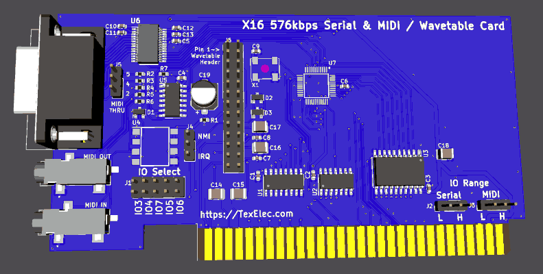

# Appendix C: Official Expansion Cards

This is just a stub as a proposal for how to document official expansion cards
(namely those made by the core X16 team).

## Serial/MIDI UART/Wavetable Expansion Card

Kevin is desinging an EIA compliant UART expansion card which is capable of supporting 
standard serial as well as MIDI and even has a header to install wavetable cards.
It uses the Texas Instruments [TL16C2550](https://www.ti.com/product/TL16C2550).

As the card is still in development there are not any demos or code examples available,
though the datasheet contains informaiton on how to set things up (see below). Kevin
also provied [some information](https://discord.com/channels/547559626024157184/548715649065811989/1183801692878295101) on how to setup the card in his original announcement on the community Discord.

