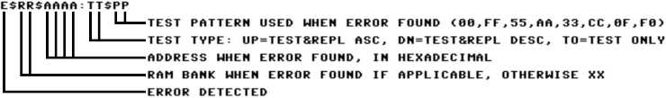

# Appendix E: Diagnostic Bank

The Diagnostic ROM bank can run a full diagnostic on the system memory (base + 512K-2048K extended) of the Commander X16.

## Index

* [Running Diagnostics](#Running-Diagnostics)
* [Progress indicators](#Progress-Indicators)
	* [Without screen](#without-screen)
	* [With screen](#with-screen)
* [Error communication](#Error-communication)
* [Test algorithm](#test-algorithm)
	* [Theory](#theory)
	* [Implementation](#implementation)

## Running Diagnostics
### POST
As of R49, short, rudimentary diagnostics are run against the VIA#1,
zeropage, and stack RAM upon every powerup. If either of these tests
fail, the diagnostic ROM will attempt to initialize the VERA to show
a failure code on screen.

During these rudimentary tests and upon failure, POST codes can be sent to I/O address
$9FFF, which resides in the IO7 range.  Before writing a code to this
address, the system will attempt to read from $9FFF to check for
an expansion card's presence. If there is no card present, or if the
card handling the range does not respond to reads at this address, it
will act as an open bus read, and return $9F.  An open bus read will
cause the POST code to be written.  If any other value besides $9F is
read from $9FFF, the write is skipped.  This design allows POST codes
to be written in the presence of passive logical analysis hardware
while hopefully avoiding putting other expansion cards into a bad
state.

POST code format: `%FSSSCCCC`  
F = 1 for a critical fault (system will not continue booting), 0 for normal operation  
`SSS` = subsystem  
`CCCCCCC` = code  

| Subsystem | Description    |
|-----------|----------------|
| `%000`    | Generic status |
| `%001`    | VERA           |
| `%010`    | VIA#1          |
| `%011`    | RAM            |

The following table is a list of POST codes. In rows containing two codes,
the first code indicates the check is about to start, and the second code
indicates a failure of the check.

| Code      | Description                              |
|-----------|------------------------------------------|
| `$01`     | POST complete                            |
| `$20/$A0` | Check VIA#1                              |
| `$30/$B0` | Check zeropage RAM                       |
| `$31/$B1` | Check stack RAM                          |
| `$90`     | POST failure: Waiting for VERA init      |
| `$91`     | POST failure: Initializing VERA          |
| `$92`     | POST failure: VERA not ready             |

### Functional system
The memory diagnostics can be started in two different ways. If the system is functional enough to actually boot into BASIC, the diagnostics can be started from there with the following:  
```BASIC
BANK 0,7: SYS $C000
```

It is also possible to jump directly to the diagnostic ROM bank from assembly.  
```asm
	lda	#$07    ; ROM bank 7 is the diagnostic bank
	sta	$01     ; Write ROM bank to ROM bank registers
	jmp	$C000   ; Jump to beginning of diagnostic ROM
```  

NOTE: The Diagnostic ROM is not able to return to BASIC or any program that has called. The only way to exit the Diagnostic ROM is by resetting or power cycling the system.
### Non functional system
If the Commander X16 is not able to boot into BASIC, the memory diagnostics can be started by keeping the power button pressed for about a second when powering on the system.  
This will make the Commander X16 boot directly into the diagnostic ROM bank and start the memory diagnostics.

## Progress indicators
### Without screen
When the diagnostic ROM bank starts, it will use the activity LED to indicate the progress.  
* ON - while zero-page memory is tested (very brief)
* OFF - for 1st test of base memory (\$0100-\$9EFF)
* ON - for 2nd test of base memory (\$0100-\$9EFF)
* OFF - for 3rd test of base memory (\$0100-\$9EFF)
* ON - for 4th test of base memory (\$0100-\$9EFF)
  
After the initial test of base memory, the number of available memory banks is tested, VERA is initialized and both the activity LED and the keyboard LEDs are used to indicate the progress.  
The keyboard LEDs are used as a binary counter:  
| Num | Binary | Num Lock | Caps Lock | Scroll Lock |
|-----|--------|----------|-----------|-------------|
|  0  |  000   |    0     |     0     |      0      |
|  1  |  001   |    0     |     0     |      1      |
|  2  |  010   |    0     |     1     |      0      |
|  3  |  011   |    0     |     1     |      1      |
|  4  |  100   |    1     |     0     |      0      |
|  5  |  101   |    1     |     0     |      1      |
|  6  |  110   |    1     |     1     |      0      |
|  7  |  111   |    1     |     1     |      1      |
  
#### Main test loop
During the first test iteration, the keyboard LEDs will display 0 0 1  
When the test is done, the activity light will blink once.  
During the second test iteration, the keyboard LEDs will display 0 1 0  
When the test is done, the activity light will blink once.  
During the third test iteration, the keyboard LEDs will display 0 1 1  
When the test is done, the activity light will blink once.  
During the fourth test iteration, the keyboard LEDs will display 1 0 0  
When the test is done, the activity light will blink once.  

As the last part of the test loop, the base memory is tested. Keyboard LEDs will show 1 0 1  
When the test loop is done, keyboard LEDs will show 1 1 1 and the activity LED will blink 3 times before starting over.
### With screen
When the base memory has been tested the first time, VERA is initialized with output to VGA.  
On the screen there is detailed information about the progress of each test iteration.  
Each time through the main test loop, the output of VERA will be switched between VGA and Composite/S-Video.  

## Error communication
If an error is detected before VERA is initialized, the error will be reported with the activity LED by blinking every half second 3 times, staying off for 1 second and repeating. - All tests stop.  
  
This means that if an error occurs before VERA is initialized, you have no way of figuring out exactly where the error is, but you do know that the error has happened in base memory.  
  
When the initial test of base memory has succeeded and VERA is initialized, any errors will be reported to the display. Only if more than 32 errors are encountered, will the tests stop and the activity LED will flash the same way as when an error is encountered before VERA initialization.  
  
Even when tests are stopped, VERA output will still be switched between VGA and Composite/S-Video about every minute.
  
The error codes on screen are as follows:


## Test algorithm
### Theory
RAM diagnostics are performed with the March C- algorithm. This algorithm should be fairly good at finding most common memory errors.  
  
In short, the algorithm is described as follows:
1. Write 0 to all memory cells
2. For each cell, check that it contains 0 and write 1 in ascending order
3. For each cell, check that it contains 1 and write 0 in ascending order
4. For each cell, check that it contains 0 and write 1 in descending order
5. For each cell, check that it contains 1 and write 0 in descending order
6. Check that all cells contain 0
  
On the Commander X16 and most other 6502 based computers, above algorithm would take a very long time to complete. For this reason, the algorithm has been modified slightly to write and compare entire bytes instead of single bits.
To catch most memory errors, the following bit patterns are tested:
* 0000 0000
* 0101 0101
* 0011 0011
* 0000 1111
  
The algorithm is then implemented in the following way:
1. Write pattern to all memory addresses
2. For each address, check the pattern and write the inverted pattern in ascending order
3. For each address, check the inverted pattern and write the original pattern in ascending order
4. For each address, check the original pattern and write the inverted pattern in descending order
5. For each address, check the inverted pattern and write the original pattern in descending order
6. Check all addresses contain the original pattern
### Implementation
When memory test starts, the first thing that happens is that zero-page is tested by itself. If this test passes, the rest of base memory is tested from \$0100-\$9EFF while ensuring that these tests do not affect zero-page memory.  
  
When base memory has passed the initial test, zero-page is used for variables and stack pointer is initialized to enable pushing and popping of registers and function calls.  
VERA is initialized and the number of memory banks is tested.  
  
All available memory banks are tested together as opposed to checking and clearing a single memory page at a time.  
When all memory banks have been tested, the base memory \$0200-\$9EFF is tested again.  
  
Memory banks and base memory is tested in continuous loop.  
  
If an error is detected, this is either communicated through the activity LED, if VERA has not yet been initialized, or by writing information about the error on the display.
<!-- For PDF formatting -->
<div class="page-break"></div>
