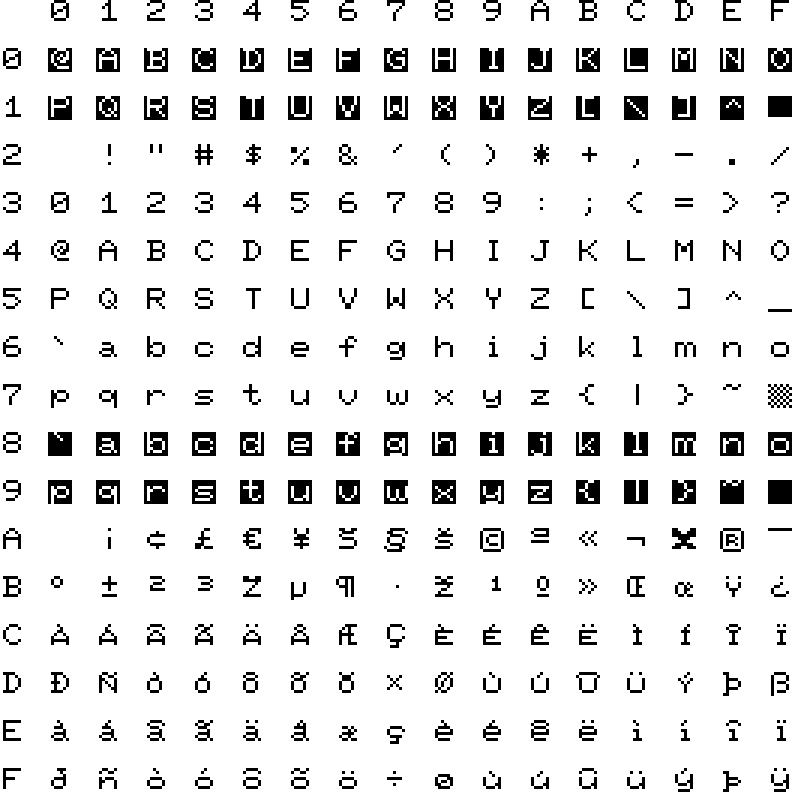

# Appendix I: Character Sets

From ROM version R48 there are a total of 12 character sets build in. The different character sets are listed below with a short description of their history and/or use cases.

## Index

1) [ISO](#iso)
2) [PET Uppercase / Graphics](#pet-uppercase--graphics)
3) [PET Uppercase / Lowercase](#pet-uppercase--lowercase)
4) [PET Uppercase / Graphis (thin)](#pet-uppercase--graphics-thin)
5) [PET Uppercase / Lowercase (thin)](#pet-uppercase--lowercase-thin)
6) [ISO (thin)](#iso-thin)
7) [CP437](#cp437)
8) [Cyrillic ISO](#cyrillic-iso)
9) [Cyrillic ISO (thin)](#cyrillic-iso-thin)
10) [Eastern Latin ISO](#eastern-latin-iso)
11) [Eastern ISO (thin)](#eastern-iso-thin)
12) [Katakana (thin)](#katakana-thin)

\pagebreak

# ISO
  
Added to the kernal early on to provide a characterset with international letters and glyphs.

\pagebreak

# PET Uppercase / Graphics
  
The default character set of the Commodore 64 and Commander X16, usually referred to as PETSCII. It provides only uppercase letters along with glyphs that can be used for doing simple text based drawings.

\pagebreak

# PET Uppercase / Lowercase
  
This character set is also present in the Commodore 64 kernal and provides both upper- and lowercase letters at the expense of some of the glyphs used for text based drawing.

\pagebreak

# PET Uppercase / Graphics (thin)
  
The default PETSCII character set, but with thinner characters to give a different aesthetic.

\pagebreak

# PET Uppercase / Lowercase (thin)
  
The standard upper- and lowercase PETSCII character set made thin for a different aesthetic.

\pagebreak

# ISO (thin)
  
The ISO character set with thin characters for a different aesthetic.

\pagebreak

# CP437
  
Added in ROM version R47. This is the character set of the original IBM PC, sometimes referred to as the ANSI character set. It is useful for displaying text created on a PC for example when connecting to BBS'es.

\pagebreak

# Cyrillic ISO
  
Added in ROM version R47. Provides Cyrillic letters used in languages such as Bulgarian, Belarusian, Russian, Serbian and Macedonian. Also known as ISO-8859-5.

\pagebreak

# Cyrillic ISO (thin)
  
Added in ROM version R47. Thin version of the Cyrillic character set.

\pagebreak

# Eastern Latin ISO
  
Added in ROM version R47. Provides eastern european letters used in languages such as Albanian, Croatian, Hungarian, Polish, Romanian, Serbian and Slovenian, but also French, German and Italian. Also known as ISO-8859-16.

\pagebreak

# Eastern ISO (thin)
  
Added in ROM version R47. Thin version of the Eastern Latin ISO character set.

\pagebreak

# Katakana (thin)
  
Added in ROM version R48. Provides katakana characters for the Japanese and Ainu languages.
