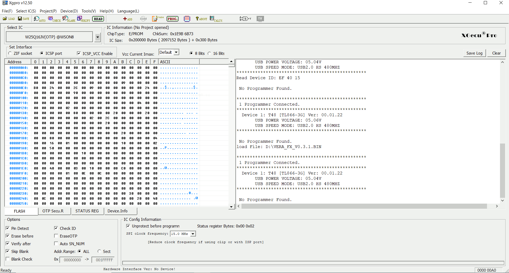

# Appendix XX: VERA firmware upgrade

**WARNING: This is a draft that may contain errors or omission that could damage your hardware.**

**Target component:** VERA  
**Programmer:** TL866-3G/T48  
**Software:** Xgpro  
**Host OS:** Windows  

## Before you start

Before you start the update procedure, it is important that
you disconnect the X16 from the wall socket. Power is supplied to the
VERA board even when the X16 is turned off.

To do the upgrade you need the following:
- A TL866-3G/T48 programmer
- The Xgpro software
- Female-to-female jump wires

## Programmer wiring setup

The VERA 8-pin header is connected to the programmer's
16-pin ICSP header as set below:

| VERA pin    | Connect to                  |
|-------------|-----------------------------|
| 1 +5V       | Not connected               |
| 2 CDONE     | Not connected               |
| 3 CRESET_B  | VERA, pin 8 (GND)           |
| 4 SPI_MISO  | TL866-3G/T48, pin 5 (MISO)  |
| 5 SPI_MOSI  | TL866-3G/T48, pin 15 (MOSI) |
| 6 SPI_SCK   | TL866-3G/T48, pin 7 (SCK)   |
| 7 SPI_SEL_N | TL866-3G/T48, pin 1 (/CS)   |
| 8 GND       | TL866-3G/T48, pin 16 (GND)  |

Image 1: Vera 8-pin programming header. 

Image 2: TL866-3G/T48 ICSP header. 

Image 3: Schematics for connection between the VERA and the TL866-3G/T48. 

## Powering the target component

The VERA board is programmed while mounted in the X16 and powered
by the computer's PSU, not by the programmer.

Verify that the wiring is correct, and then connect the X16 
to the wall socket. Press the
computer's power button to ensure that 5V is supplied to
to the VERA board.

The VERA's FPGA is held in reset as VERA pin 3 (CRESET_B)
is connected to ground. This means that you will not get
any screen output.

## Programmer software setup

Open the Xgpro software and apply the following settings:

- Select target chip: W25Q16JV
- Setup interface: Select ICSP port, uncheck ICSP_VCC_Enable
- Click ID Check to verify the connection
    - The response value should be EF 40 15
    - If not, check the wiring before you proceed

## Update procedure

In the Xgpro software:
- Click Load to load the firmware into the software buffer
- Click Prog. to upload the firmware to VERA

When the update is done, press the power button and then disconnect the X16 from the wall socket. Remove all wires from the VERA pin header,
and the update is done.